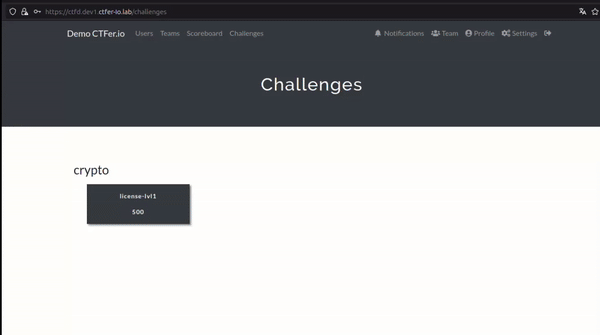
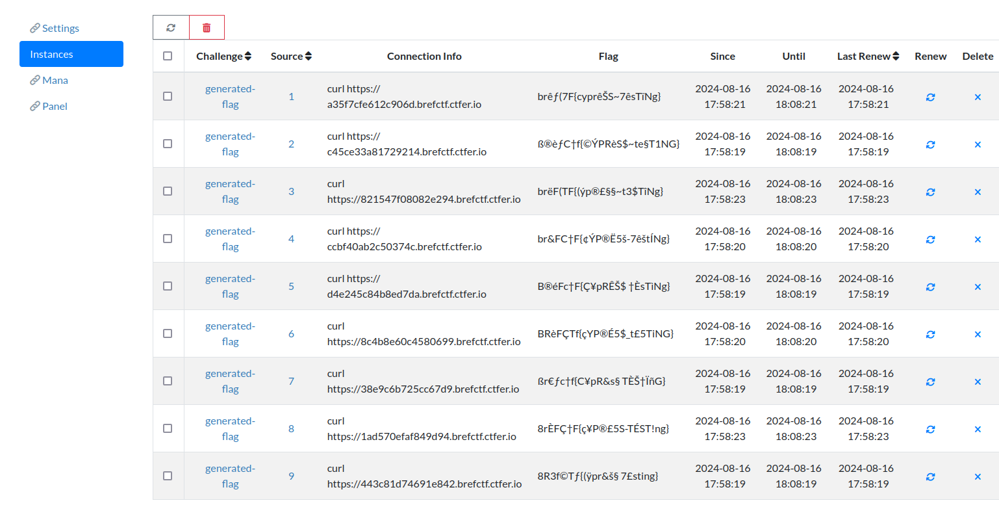

<h1>CTFd-chall-manager</h1>

<b>Level Up CTFd with Infra-as-Code Challenges!</b>

	

This plugin allow you to use the [chall-manager](https://github.com/ctfer-io/chall-manager), to manage scenario and permit Player's to deploy their instances.

# Features
## Main features for Users
- Booting/Destroying Instance by Source
- Sharing Instance between all Sources
- Restriction based on Mana
- Use flag variation proposed by [chall-manager](https://github.com/ctfer-io/chall-manager)

## Main features for Admins
- Create challenges with Scenario
- Preprovisionng Instances for Source
- Monitor all mana used by Sources

# How install and use
To install the plugin, you need to clone the repository in `CTFd/plugins` folders.  
To use the plugin, refer to the documentation at https://ctfer.io/docs#ctfd-chall-manager .

# Glossaries

| Label    | Description                                                                                 |
|----------|---------------------------------------------------------------------------------------------|
| Sources  | In CTFd "Teams" mode, the Source is Team  In CTFd "Users" mode, the Source is User       |
| Scenario | Pulumi project that define the challenge (webserver, ssh server, ...) to deploy an Instance |
| Instances| This is a copy of Scenario for the Source that make the request                             |
| Mana     | This is the "money" to regulate the Instance's deployment                                   |

