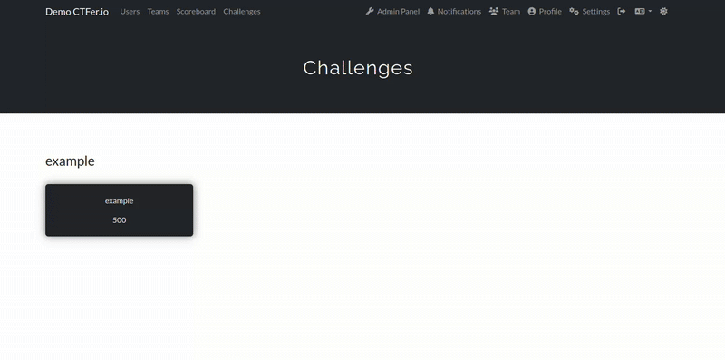
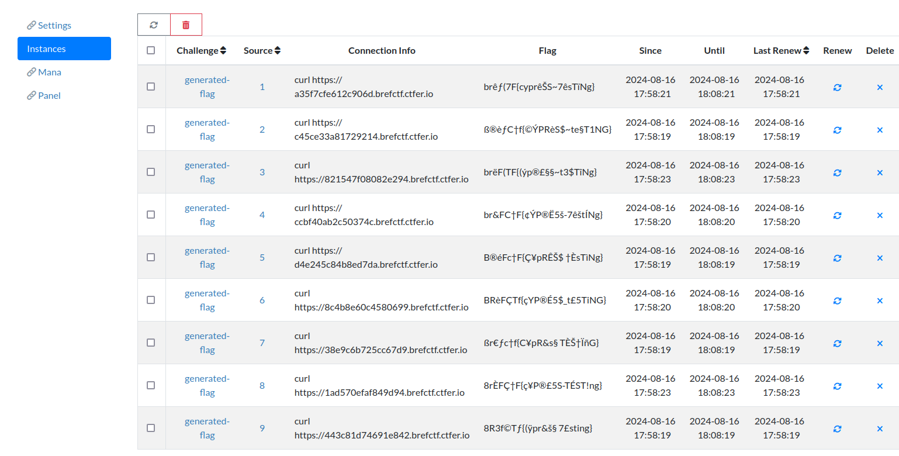

<div align="center">
<h1>CTFd-chall-manager</h1>
<p><b>Level Up CTFd with Infra-as-Code Challenges!</b><p>
<a href=""></a>
<a href="https://github.com/ctfer-io/ctfd-chall-manager/actions?query=workflow%3Aci+"></a>
<a href="https://github.com/ctfer-io/ctfd-chall-manager/actions/workflows/codeql-analysis.yaml"></a>
<a href="https://securityscorecards.dev/viewer/?uri=github.com/ctfer-io/ctfd-chall-manager"></a>
</div>

> [!CAUTION]
> CTFd-chall-manager is currently in public beta phase.
> It could be run in production, but breaking changes are subject to happen in the upcoming months until General Availability.

This plugin allow you to use the [chall-manager](https://github.com/ctfer-io/chall-manager) with CTFd, to manage scenario and permit players to deploy their instances.

Last version of CTFd tested on: [3.8.3](https://github.com/CTFd/CTFd/releases/tag/3.8.3).

Last version of Chall-Manager tested on: [v0.6.5](https://github.com/ctfer-io/chall-manager/releases/tag/v0.6.5).

## 📦 What CTFd-chall-manager Does
- **On-Demand Instances**: Players can deploy and destroy their own isolated challenge instances.
- **Shared Instances**: Teams or users can use on a single instance, depending on challenge settings.
- **Rate Limiting**: Mana-based system prevents infrastructure overload by controlling instance deployment.
- **Unique Flags**: Each instance generates custom, unique flags for fair and dynamic gameplay.





## 📦 Installation

For installation and usage instructions, see the [official documentation](https://ctfer.io/docs/ctfd-chall-manager).

## 🏆 Trophy list

The following list contains all known public events where Chall-Manager has been operated in production (YYYY/MM/DD):

- 2024/11/20 [NoBracketsCTF 2024](https://github.com/nobrackets-ctf/NoBrackets-2024)
- 2025/02/09 [ICAISC 2025](https://www.linkedin.com/feed/update/urn:li:ugcPost:7295762712364544001/?actorCompanyId=103798607)
- 2025/03/08 Hack'lantique 2025
- 2025/05/17 [WhiteHats TrojanCTF 2025](https://github.com/ESHA-Trojan/TrojanCTF-2025-public)
- 2025/05/24 [24h IUT 2025](https://www.linkedin.com/feed/update/urn:li:activity:7332827877123506177/)
- 2025/11/29 [GreHack25](https://www.linkedin.com/posts/grehack_grehack25-activity-7401272551294787584-8ULF)

Please [open an issue](https://github.com/ctfer-io/ctfd-chall-manager/issues/new) to add your event to the list if we did not ourself.

## 🔨 Development setup

You can find several docker based setup in [hack](/hack) folder.

```bash
# Clone CTFd on the latest stable tag
git clone git@github.com:CTFd/CTFd.git
cd CTFd
git checkout <TAG> # use latest stable tag

# Clone CTFd-chall-manager plugin
cd CTFd/plugins
git clone git@github.com:ctfer-io/ctfd-chall-manager.git ctfd_chall_manager

# Start dev
cd ctfd_chall_manager/hack
docker compose up 
```

You can run tests with following [procedure](/test/README.md).

---
Shoutout to [ctfd-whale](https://github.com/frankli0324/CTFd-Whale) which helped us a lot to create this plugin.
